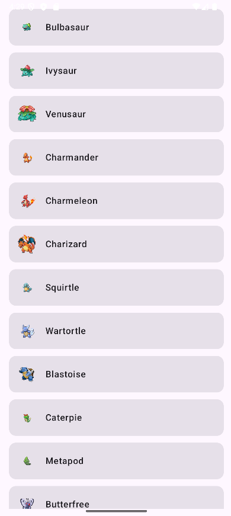
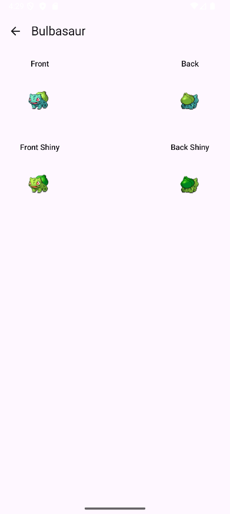

# Laboratorio 6 — PokeAPI + MVVM + Jetpack Compose

Aplicación Android que consume la **PokeAPI** para:
1) Listar los **primeros 100 Pokémon**.
2) Mostrar el **detalle** de cada Pokémon con sus **4 sprites** (Front, Back, Front Shiny, Back Shiny).

Refactor del Lab5 a **MVVM** (Clean Architecture simplificada): separación de responsabilidades entre **UI → ViewModel → Repository → Data (Retrofit)**, exposición de estado con **StateFlow** y manejo básico de **errores**.

---

## 📱 Demo (Screenshots)

| Lista | Detalle |
|---|---|
|  |  |

---

## 🛠️ Tech Stack

- **Kotlin** + **Coroutines**
- **Jetpack Compose** (UI declarativa) + **Material 3**
- **Navigation Compose**
- **Lifecycle ViewModel**
- **StateFlow** (Kotlin Flow)
- **Retrofit** + **Moshi** (JSON)
- **OkHttp** (+ Logging Interceptor)
- **Coil** (carga de imágenes)

---

## 🧱 Arquitectura (MVVM, Clean Architecture simplificada)

- **UI (Compose)**  
  `PokemonListScreen`, `PokemonDetailScreen`  
  Renderizan según un `UiState` colectado desde **StateFlow** y muestran botón **Reintentar** cuando hay error.

- **ViewModel**  
  `MainViewModel`, `PokemonDetailViewModel`  
  Orquestan la lógica de presentación (`load()` / `load(id)`), actualizan `loading / data|items / error`.

- **Repository**  
  `MainRepository`  
  Intermediario entre UI y datos remotos. Aísla a los ViewModels de Retrofit.

- **Data (Remote)**  
  `ApiService` + `RetrofitClient`  
  Define endpoints de PokeAPI y la configuración de red (timeouts, logging, Moshi).

---

## 🗂️ Estructura del proyecto

```
app/src/main/java/com/example/laboratorio6/
├─ data/
│  ├─ model/
│  │  ├─ PokemonListResponse.kt
│  │  └─ PokemonDetail.kt
│  ├─ remote/
│  │  ├─ ApiService.kt          // Endpoints Retrofit
│  │  └─ RetrofitClient.kt      // Retrofit + OkHttp + Moshi
│  └─ repository/
│     └─ MainRepository.kt      // Intermediario VM <-> Data
├─ ui/
│  ├─ MainViewModel.kt          // StateFlow (lista)
│  ├─ list/
│  │  └─ PokemonListScreen.kt   // UI lista + retry
│  └─ detail/
│     ├─ PokemonDetailViewModel.kt
│     └─ PokemonDetailScreen.kt // UI detalle + retry
└─ MainActivity.kt               // NavHost
```

> *Nota:* No se requiere un objeto `Routes`; la navegación puede construirse directamente en `MainActivity`.

---

## 🌐 API utilizada

- **Base URL**: `https://pokeapi.co/api/v2/`
- **Endpoints**:
    - Listado: `GET /pokemon?limit=100`
    - Detalle: `GET /pokemon/{id}`

Agradecimientos a **PokeAPI** por el servicio público.

---

## 🚀 Requisitos

- Android Studio **Koala** o superior
- **JDK 17**
- **minSdk**: 24
- **compileSdk**: 34

*(Ajusta estos valores si tu `build.gradle.kts` difiere.)*

---

## ▶️ Ejecución

1. Clona el repositorio:
   ```bash
   git clone https://github.com/Junjey123-mx/Laboratorio6.git
   ```
2. Abre el proyecto en **Android Studio**.
3. Sincroniza Gradle.
4. Ejecuta en emulador/dispositivo:
    - Botón **Run ▶ app**, o
    - Terminal:
      ```bash
      ./gradlew assembleDebug
      ```

---

## 🔒 Permisos

- `INTERNET` — necesario para consultar la PokeAPI.

---

## ⚠️ Manejo de errores

- Si la llamada de red falla, la **UI muestra un mensaje** y un botón **“Reintentar”**:
    - Lista: `Button { vm.load() }`
    - Detalle: `Button { vm.load(id) }`

Para verificarlo, activa **modo avión**, fuerza cierre de la app y vuelve a abrir.

---

## 📄 Licencia

Proyecto **educativo**.  
Los sprites e identidades visuales pertenecen a sus autores originales y provienen de **PokeAPI**.
